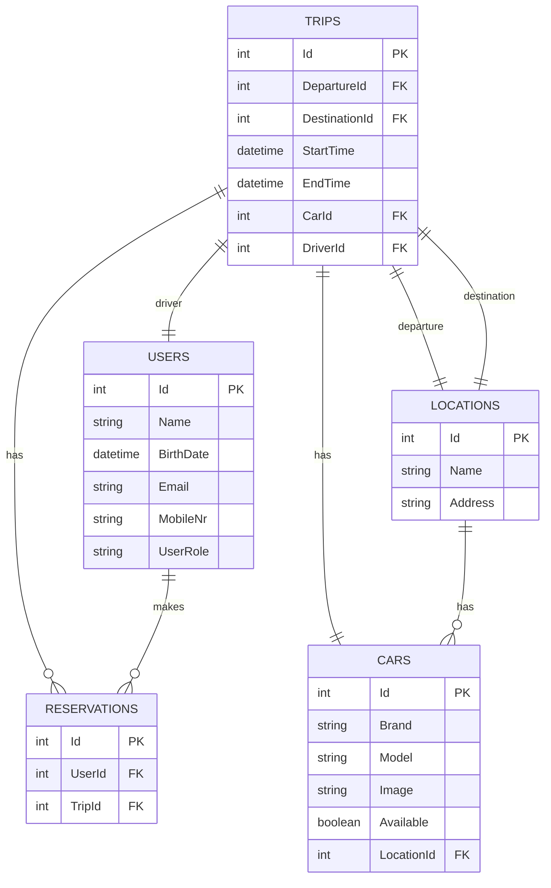

# RideLinkerAPI
### (Documentatie voor de Backend .NET Applicatie voor Ritreserveringen bij CM Bedrijf)

## Applicatiebeschrijving
Deze documentatie biedt een uitgebreid overzicht van de backend .NET applicatie ontwikkeld voor het CM bedrijf. Deze applicatie is speciaal ontworpen om het proces van het reserveren van ritten te stroomlijnen, waardoor werknemers van CM eenvoudig en effici�nt vervoer kunnen regelen.

## Applicatiegebruik
Gebruikers moeten zich registreren en inloggen om de RideLinkerAPI te gebruiken. Na inloggen kunnen zij een rit aanvragen door vertrek- en bestemmingslocaties in te voeren, waarna de applicatie hen koppelt aan beschikbare ritten. Het is ook mogelijk om op een bestaande rit in te schrijven en met medereizigers te communiceren.

## Applicatiefunctionaliteit

## Applicatiearchitectuur
De applicatie is ontworpen volgens de principes van de Clean Architecture, waarbij de applicatie is opgedeeld in verschillende lagen met een duidelijke scheiding van zorgen. De applicatie is opgedeeld in een domeinlaag, een applicatielaag en een infrastructuurlaag. De domeinlaag bevat de kernentiteiten en de bedrijfslogica. De applicatielaag bevat de controllers die de API-eindpunten afhandelen en de services die de bedrijfslogica aansturen. De infrastructuurlaag bevat de implementaties voor data-toegang, inclusief de repository patronen en de database migraties.

### Core
- **Core.Domain**: Definieert de entiteiten die de kern vormen van het bedrijfsdomein, zoals Car, Location, Reservation, Role, Trip, en User.
- **Core.DomainService**:	
- **Interfaces**: Contracten voor de services die de bedrijfslogica voor domeinentiteiten zullen aansturen.
- **Services**: Concreet ge�mplementeerde services die de domeinlogica uitvoeren.
### Infrastructure
- **Infrastructure.RL**: Bevat implementaties voor data-toegang, inclusief:
- **Migrations**: Beheert database migraties.
- **Repositories**: Implementaties van de repository patronen voor databasebewerkingen.
### RideLinkerAPI
- **Controllers**: Controllers die de API-eindpunten afhandelen en beschikbaar stellen.
- **Models**: ViewModel-klassen voor dataoverdracht.
- **Tests**: Unit tests voor de validatie van applicatiefunctionaliteiten.

## Kernfunctionaliteiten
- Ritbeheer: Aanmaken, bijwerken, verwijderen en ophalen van ritgegevens.
- Auto Beheer: Beheer van de voertuigen voor de ritten.
- Reserveringsbeheer: Mogelijkheid voor gebruikers om ritten te reserveren.
- Gebruikersbeheer: Beheer van gebruikersaccounts en autorisaties.
- Locatiebeheer: Beheer van vertrek- en aankomstlocaties.

## Gebruikte technologie�n
- **.NET Core 8**: De applicatie is ontwikkeld met behulp van het .NET Core 8 framework.
- **Entity Framework Core**: De applicatie maakt gebruik van Entity Framework Core voor data-toegang.
- **SQL Server**: De applicatie maakt gebruik van een SQL Server database voor data-opslag.
- **Swagger**: De applicatie maakt gebruik van Swagger voor het documenteren van de API.
- **xUnit**: De applicatie maakt gebruik van xUnit voor het testen van de applicatiefunctionaliteiten.
- **Moq**: De applicatie maakt gebruik van Moq voor het mocken van de applicatiefunctionaliteiten.

## API Ontwerp
De API is ontworpen volgens de principes van REST. De API heeft de volgende eindpunten:

| Controller | Endpoints |
|------------|-----------|
| CarsController | /api/cars |
| LocationsController | /api/locations |
| ReservationsController | /api/reservations |
| TripsController | /api/trips |
| UsersController | /api/users |
| UsersController | /api/users/authenticate |
| UsersController | /api/users/register |

### Users API Endpoints

| Method | Endpoint       | Action         | Auth Required | Description                            |
|--------|----------------|----------------|---------------|----------------------------------------|
| GET    | /api/user      | GetAllUsers    | Yes           | Retrieves a list of all users.         |
| GET    | /api/user/{id} | GetUserById    | Yes           | Retrieves a specific user by ID.       |
| POST   | /api/user      | AddUser        | Yes           | Adds a new user to the system.         |
| PUT    | /api/user/{id} | UpdateUser     | Yes           | Updates an existing user's information.|
| DELETE | /api/user/{id} | DeleteUser     | Yes           | Deletes a specific user by ID.         |

### Trips API Endpoints

| Method | Endpoint      | Action        | Auth Required | Description                            |
|--------|---------------|---------------|---------------|----------------------------------------|
| GET    | /api/trip     | GetAllTrips   | Yes           | Retrieves a list of all trips.         |
| GET    | /api/trip/{id}| GetTripById   | Yes           | Retrieves a specific trip by ID.       |
| POST   | /api/trip     | AddTrip       | Yes           | Adds a new trip to the system.         |
| PUT    | /api/trip/{id}| UpdateTrip    | Yes           | Updates an existing trip's information.|
| DELETE | /api/trip/{id}| DeleteTrip    | Yes           | Deletes a specific trip by ID.         |

### Locations API Endpoints

| Method | Endpoint               | Action            | Auth Required | Description                               |
|--------|------------------------|-------------------|---------------|-------------------------------------------|
| GET    | /api/location          | GetAllLocations   | Yes           | Retrieves a list of all locations.        |
| GET    | /api/location/{id}     | GetLocationById   | Yes           | Retrieves a specific location by ID.      |
| POST   | /api/location          | AddLocation       | Yes           | Adds a new location to the system.        |
| PUT    | /api/location/{id}     | UpdateLocation    | Yes           | Updates an existing location's information.|
| DELETE | /api/location/{id}     | DeleteLocation    | Yes           | Deletes a specific location by ID.        |

### Reservation API Endpoints

| Method | Endpoint                 | Action              | Auth Required | Description                                   |
|--------|--------------------------|---------------------|---------------|-----------------------------------------------|
| GET    | /api/reservation         | GetAllReservations  | Yes           | Retrieves a list of all reservations.         |
| GET    | /api/reservation/{id}    | GetReservationById  | Yes           | Retrieves a specific reservation by ID.       |
| POST   | /api/reservation         | AddReservation      | Yes           | Adds a new reservation to the system.         |
| PUT    | /api/reservation/{id}    | UpdateReservation   | Yes           | Updates an existing reservation's information.|
| DELETE | /api/reservation/{id}    | DeleteReservation   | Yes           | Deletes a specific reservation by ID.         |

### Cars API Endpoints

| Method | Endpoint                 | Action              | Auth Required | Description                                   |
|--------|--------------------------|---------------------|---------------|-----------------------------------------------|
| GET    | /api/car                 | GetAllCars          | Yes           | Retrieves a list of all cars.                 |
| GET    | /api/car/{id}            | GetCarById          | Yes           | Retrieves a specific car by ID.               |
| POST   | /api/car                 | AddCar              | Yes           | Adds a new car to the system.                 |
| PUT    | /api/car/{id}            | UpdateCar           | Yes           | Updates an existing car's information.        |
| DELETE | /api/car/{id}            | DeleteCar           | Yes           | Deletes a specific car by ID.                 |

### Authentication API Endpoints

| Method | Endpoint                 | Action              | Auth Required | Description                                   |
|--------|--------------------------|---------------------|---------------|-----------------------------------------------|
| POST   | /api/users/authenticate  | AuthenticateUser    | No            | Authenticates a user.                         |
| POST   | /api/users/register      | RegisterUser        | No            | Registers a new user.                         |
| POST   | /api/users/logout        | LogoutUser          | Yes           | Logs out a user.                              |

## Teststrategie
De applicatie is getest met behulp van unit tests. De unit tests zijn geschreven met behulp van xUnit en Moq. De unit tests zijn geschreven voor de controllers. De unit tests voor de controllers testen de validatie van de API-eindpunten en de applicatiefunctionaliteiten.

## Databaseontwerp
De applicatie maakt gebruik van een SQL Server database voor data-opslag. De database bevat de volgende tabellen:

### Tabel Locaties
- **Doel**: Opslaan van informatie over verschillende locaties waar reizen kunnen beginnen of eindigen.
- **Velden**:
  - `Id`: De primaire sleutel voor de locatierecord.
  - `Naam`: De naam van de locatie.
  - `Adres`: Het adres van de locatie.
- **Genomen Beslissingen**: Elke locatie heeft een unieke identificatie en slaat de naam en het adres op voor gebruik bij het aanmaken van reizen.

### Tabel Auto's
- **Doel**: Bijhouden van alle auto's die beschikbaar zijn voor reizen.
- **Velden**:
  - `Id`: De primaire sleutel voor de autorecord.
  - `Merk`: Het merk of de fabrikant van de auto.
  - `Model`: Het specifieke model van de auto.
  - `Afbeelding`: Een link of binaire gegevens voor een afbeelding van de auto.
  - `Beschikbaar`: Een boolean die aangeeft of de auto beschikbaar is voor reizen.
  - `LocatieId`: Vreemde sleutel die koppelt aan de `Locaties` tabel om aan te geven waar de auto zich bevindt.
- **Genomen Beslissingen**: Auto's zijn geassocieerd met locaties om snelle toegang en boeking te vergemakkelijken. De beschikbaarheidsvlag wordt gebruikt om auto's te filteren voor reisplanning.

### Tabel Gebruikers
- **Doel**: Beheren van gebruikersinformatie.
- **Velden**:
  - `Id`: De primaire sleutel voor de gebruikersrecord.
  - `Naam`: De volledige naam van de gebruiker.
  - `Geboortedatum`: De geboortedatum van de gebruiker.
  - `Email`: Het e-mailadres van de gebruiker.
  - `MobielNr`: Het mobiele nummer van de gebruiker.
  - `GebruikersRol`: De rol van de gebruiker binnen het systeem (bijv. admin, chauffeur, passagier).
- **Genomen Beslissingen**: Gebruikers zijn centraal in het systeem, en hun rollen bepalen hun interactie met de applicatie. Contactinformatie wordt opgeslagen voor communicatiedoeleinden.

### Tabel Reizen
- **Doel**: Bevat details over gemaakte of te maken reizen.
- **Velden**:
  - `Id`: De primaire sleutel voor de reisrecord.
  - `VertrekId`: Vreemde sleutel gekoppeld aan de `Locaties` tabel voor het startpunt.
  - `BestemmingId`: Vreemde sleutel gekoppeld aan de `Locaties` tabel voor het eindpunt.
  - `StartTijd`: De geplande starttijd van de reis.
  - `EindTijd`: De geplande eindtijd van de reis.
  - `AutoId`: Vreemde sleutel gekoppeld aan de `Auto's` tabel die aangeeft welke auto wordt gebruikt.
  - `BestuurderId`: Vreemde sleutel gekoppeld aan de `Gebruikers` tabel die de bestuurder aangeeft.
- **Genomen Beslissingen**: Reizen zijn gekoppeld aan specifieke auto's en locaties, waardoor het gebruik van voertuigen en routebeheer kan worden gevolgd. De relatie met de `Gebruikers` tabel identificeert wie de auto bestuurt.

### Tabel Reserveringen
- **Doel**: Bevat gegevens over gebruikersreserveringen voor specifieke reizen.
- **Velden**:
  - `Id`: De primaire sleutel voor de reserveringsrecord.
  - `GebruikerId`: Vreemde sleutel gekoppeld aan de `Gebruikers` tabel om de gebruiker die de reservering maakt te identificeren.
  - `ReisId`: Vreemde sleutel gekoppeld aan de `Reizen` tabel voor de geassocieerde reis.
- **Genomen Beslissingen**: Het reserveringssysteem is ontworpen om gebruikers te koppelen aan reizen die ze willen maken. Dit maakt het beheer van boekingen en de beschikbaarheid van reizen mogelijk.

### Database Relaties
- **Eén-tot-veel**: `Locaties` naar `Reizen` (een locatie kan het begin- of eindpunt zijn voor veel reizen), `Auto's` naar `Reizen` (een auto kan voor veel reizen worden gebruikt), `Gebruikers` naar `Reizen` (een gebruiker kan in veel reizen rijden), `Gebruikers` naar `Reserveringen` (een gebruiker kan veel reserveringen hebben), `Reizen` naar `Reserveringen` (een reis kan veel reserveringen hebben).
- **Genomen Beslissingen**: Deze relaties vangen de essentie van een carpool- of ridesharingdienst, waardoor uitgebreide tracking van reisdetails, reserveringen en het gebruik van auto's mogelijk is.

Dit databaseontwerp ondersteunt de operationele behoeften van RideLinker applicatie door gebruikers, hun reizen en de voertuigen die voor deze reizen worden gebruikt, aan elkaar te koppelen. Het maakt efficiënte gegevensopslag en -opvraging mogelijk, met de mogelijkheid om te schalen naarmate er nieuwe gebruikers, locaties en auto's aan het systeem worden toegevoegd. De relationele structuur zorgt voor gegevensintegriteit en biedt een solide basis voor complexe queries die nodig kunnen zijn voor rapportage of operationele doeleinden.

Daarnaast zijn bepaalde ontwerpbeslissingen waarschijnlijk beïnvloed door de volgende overwegingen:

- **Normalisatie**: Het ontwerp suggereert een genormaliseerd schema waarbij overbodige gegevens tot een minimum worden beperkt. Elke entiteit wordt één keer weergegeven met relaties naar andere entiteiten, wat duplicatie en potentiële gegevensanomalieën vermindert.
- **Schaalbaarheid**: Het ontwerp biedt ruimte voor groei. Nieuwe locaties, auto's en gebruikers kunnen worden toegevoegd zonder het algehele schema te wijzigen.
- **Prestatie**: Foreign keys worden gebruikt voor indexering, wat joins efficiënter kan maken bij het opvragen van gerelateerde gegevens in tabellen.
- **Flexibiliteit**: Het schema staat toe dat extra attributen aan elke tabel worden toegevoegd. Zo zou de `Auto's` tabel gemakkelijk nieuwe attributen zoals `Jaar`, `Kleur` of `Onderhoudsschema` kunnen accommoderen indien nodig.
- **Beveiliging**: Gebruikersgegevens worden opgeslagen op een manier die authenticatie en autorisatie kan vergemakkelijken. Het veld `GebruikersRol` geeft aan dat rolgebaseerde toegangscontrole wordt overwogen in het ontwerp.

Over het algemeen ondersteunt het databaseontwerp de functionele vereisten van de ride-linking applicatie en biedt het een kader dat voldoet aan goede praktijken voor databasenormalisatie.

